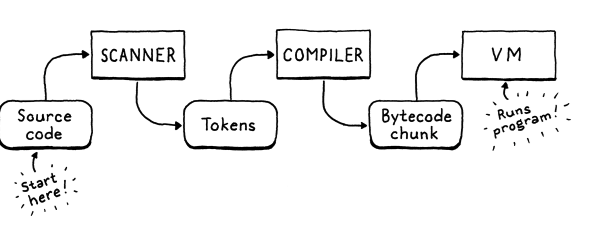

# Clox

A Bytecode Virtual Machine
This repository contains notes taken during my reading of the Crafting interpreters Book by Robert Nystrom

- A tree walk interpreter is simple, portable and slow
- Native code is complex and platform-specific but fast
- Bytecode sits in the middle. It retains the portability of a tree walker
  - resembles machine code: It's a dense linear sequence of binary instructions
  - Bytecode is a series of instructions

char = 1 byte(8 bits)
short = 2 bytes(16 bits)
int = 4 bytes(32 bits)
long = 8 bytes(64 bits) on most 64-bit systems

##### An emulator

- A simulated chip written in software that interprets the byetcode one instruction at a time.
  

## Chunks of instructions

- Each instruction has a one-byte(8 bits) operation code (universally shortened to opcode)

Dynamic arrays provide:

- Cache-friendly, dense storage
- Constant-time indexed element lookup
- Constant-time apending to the end of the array

The idea of dynamic arrays is pretty simple: we keep two numbers: the number of elements in the array we have allocated("capacity") and how many of those allocated entries are actually in use("count)

# C

- C doesn't have constructors
- -> arrow operator - combines the dereference operator with member access.
- Dereference - returns the value at a pointer's address
- arrow operator - dereferences a pointer and accesses a member
- & - Address-of - Returns the memory address of a variable
- Pointer - stores the memory address as its value

chunk->capacity: go to the memory address that chunk points to, and then access the capacity field of the struct at that address

### Disassembling Chunks

- An assembler is an old school program that takes a file containing human-readable mnemonic names for CPU instructions like "ADD" and "MULT" and translates them to their binary machine equivalent

- A disassembler goes in the other direction, given a blob of machine code, it spits out a textual listing of the instructions.

- Our disassembler:
  - Given a chunk, it will print out all of the instrutions in it

### Constants

- We can store code in chunks, but what about data?
  - Many values the interpreter works with are created at runtime as the result of operations

#### Representing Values

- how our VM should represent values
- for now, we'll only support double-precision, floating point numbers(8 bytes(64-bit) computer data type used to represent a wide range of decimal values with high accuracy)
  - Sign Bit(1 bit) - determines if the number is positive or negative
  - Exponent(11 bits) - determines the magnitue(range) of the number
  - Significand/Fraction(52 explicit bits + 1 hidden bit) - Determines the precision

For small sized fixed-values like integers, many instructions sets store the value directly in the code stream right after the opcode. These are called immediate instructions because the bits for the value are immediately after the opcode

For large or variable sized constants like strings, that doesn't work. In a native compiler to machine code, those bigger constants get stored in a separate "constant data" region in the binary executable. Then, the instruction to load a constant has an address or offset pointing to where the value is stored in that section.

For clox, similar to the Java Virtual Machine we will associate a constant pool with each compiled class.

- Each chunk will carry with it a list of values that appear as literals in the program.
- To keep things simpler, we'll put all constants in there, even simple integers.

Constant Instructions:

- We can store constants in chunks, but we also need to execute them. The compiled chunk needs to not only contains the values but also know when to produce them
- Here we introduce operands and allow instructions to have operands, so our bytecode knows which constant to load
- Bytecode instruction operands are not the same as the operands passed to the arithmetic operator
- Arithmetic operand values are tracked separately
- Instruction operands are a lower level notion that modify how the bytecode instruction itself behaves

Line information:

- Chunks contain almost all of the information that the runtime needs from the user's source code
- When a runtime error occurs, we show the user the line number of the offending source code
- Given any bytecode instruction, we need to be able to determine the line of the user's source program that it was compiled from

In the chunk:

- we store a separate array of integers that parallels the bytecode
- Each number in the array is the line number for the corresponsing byte in the bytecode. When a runtime error occurs, we look up the line number at the same index as the current instruction's offset in the code array

# An Instruction Execution Machine

- We have a compiler that detects static errors and a VM that detects runtime errors
- The first byte of any instruction is the opcode. Given a numeric opcode, we need to get to the right C code that implements that instruction's semantics. This process is called decoding or dispatching the instruction. We do that process for every single instruction, every single time one is executed, so this is the most perfomance critical part of the entire virtual machine.

## A Value Stack Manipulator

- The operands to an arithmetic operator need to be evaluated before we can perform the operation itself.
  - C and Scheme leave evaluation order unspecified. Java specifies left-to-right evaluation like we did for Lox

Our old jlox interpreter accomplishes this by recursively traversing the AST. It does a postorder traversal. In Cloc, our run() function is not recursive

Since the temporary values we need to track naturally have stack like behaviour, our VM will use a stack to manage them. When an instruction "produces" a value, it pushes it onto the stack. When it needs to consume one or more values, it gets them by popping them off the stack.

### The VM's Stack

Stack-based interpreters aren't a silver bullet. They're adequate, but modern implementations of the JVM, the CLR, and JavaScript all use sophisticated just-in-time compilation pipelines to generate much faster native code on the fly.

#### Stack tracing

- Create some visibility into the stack - whenever we are tracing execution, we'll also show the current contents of the stack before we interpret each instruction

- A binary operator takes two operands so it pops twice. It performs the operation on those two values and then pushes the result
  - You can pass an operator as an argument to a macro

# Scanning on Demand

- The first phase of compilation is scanning
- Our second interpreter has 3 phases: scanner, compiler and virtual machine
  Tokens from scanner to compiler, and chunks of bytecode from compiler to virtual machine

## A Token at A Time

- In jlox, the scanner raced ahead and returned a list of tokens
- In Clox this would mean a lot of memory churn.
- At any point in time, the Compiler only needs two tokens: only a single token of lookahead. Therefore, we do not scan a token until the compiler needs one.
- In jlox, each token stored the lexeme as its own separate little java string.
- In Clox, we use the original source string as our character store. We represent a lexeme by pointer to its first character and the number of characters it contains. This means we don't need to worry about managing memory for lexemes at all and we can freely copy tokens around. As the long as the main source code string outlives all of the tokens, everything works fine.

### Literal Tokens

The main change here in Clox, in comparison with jlox is that in Jlox, the Token class had a field of type Object to store the runtime value converted from the literal Token's lexeme.

In C that would require a lot of work: We'd need some sort of union and type tag to tell whether the token contains a string or a double value. If it's a string, we'd need to manage memory for the string's character array. Instead of adding that complexity to a scanner, we defer converting the literal lexeme to a runtime value until later on

- In Clox, tokens onlt stre rhe lexeme - the character sequence exactly as it appears in the user's source code. Later in the compiler, we'll convert that lexeme to a runtime value right when we are readyto store it in the chunk's constant table

#### Identifiers and Keywords

- Last batch of tokens are identifiers - both user defined and reserved.
-

## Tries and State Machines

- A trie stores a set of strings.
- Most other data structures for storing strings contain the raw character arrays and then wrap them inside some larger construct that helps you search faster. A trie is different. Nowhere in the trie will you find a whole string.
- Instead, each string the trie "contains" is represented as a path through the tree of a character nodes. Nodes that match the last character in a string have a special marker. Double lined boxes in the illustration.

- Tries are a special case of an even more fundamental data structure: a deterministic finite automaton(DFA), also known as finite state machine or just state machine.
  - In a DFA, you have a set of states, with transitions between them, forming a graph.
  - At any point in time, the machine is 'in' exactly one state. It gets to other states by following transitions.
  - When you use a DFA for lexical analysis, each transition is a character that gets matched from the string. Each state represents a set of allowed characters.

Our keyword tree is exactly a DFA that recognizes Lox keywords. DFAs are more powerful than simple trees because they can be arbitrary graphs.

- Transitions can form cycles between states. That lets you recognize arbitrarily long strings.
